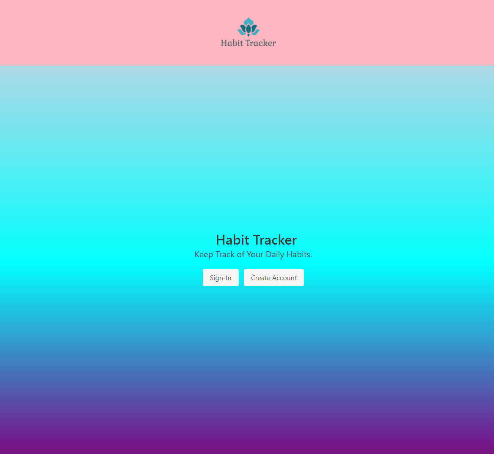

# The Habit Tracker

 [](https://opensource.org/licenses/MIT)

## Description


## Table of Contents 
* [Description](#description)
* [Installation](#installation)
* [Usage](#usage)
* [Screenshots](#screenshots)
* [License](#license)
* [Badge](#badge)
* [Creators](#creators)
* [Questions](#questions)

## Installation

To install, run the following command:  
```

```


## Usage  


## Screenshots




## License

MIT
https://opensource.org/licenses/MIT


## Badge

[](https://github.com/ellerbrock/open-source-badges/)


## Creators

| Name    | Github  |
| ------- | ----------- |
| Anthony | https://github.com/AnthonyDavis89 |
| Hunter  | https://github.com/mythosmystery |
| Erica   | https://github.com/ricapi96  |
| Asha    | https://github.com/ashak90   |
| Valentin| https://github.com/valentinGarcia-gh  |
| Wai     |                              |


## Questions

* If you have any questions or concerns, please contact any of us via our github pages above.


                                                            Created by: The Callback Cats 😺
